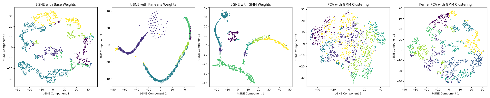

# rnn-dekm-btc

Regime clustering for BTC/USDT with a recurrent autoencoder trained by Deep Embedded K-Means (DEKM), and a Flask dashboard that classifies the live regime from the Binance kline stream and runs paper trades.

This was my final-year project for the B.DatSci at Stellenbosch University (2024). The repository is a cleaned snapshot of the research notebook, the training code and the dashboard. The written thesis is not included.



*t-SNE of the encoder's 16-dimensional latent space. Left: the plain autoencoder. Second and third: after DEKM training with k-means and with a Gaussian mixture, where the regimes separate into distinct manifolds. Right: PCA and kernel PCA on the raw features for comparison.*

## Idea

Technical strategies such as RSI mean reversion behave differently in different market regimes. Instead of hand-labelling regimes, learn them:

1. **Features.** Resample 1-minute BTC/USDT candles to 5 minutes and compute EMA, SMA, MACD, RSI and momentum over several window lengths (TA-Lib), then standardise.
2. **Sequences.** Build 60-step windows and encode each with a recurrent encoder into a 16-dimensional latent vector.
3. **DEKM.** Train the encoder jointly with a clustering objective. After each k-means pass in latent space, an eigen-decomposition of the within-cluster scatter picks the cluster-friendly subspace and the encoder is pushed towards it, as in Deep Embedded K-Means. Silhouette and Davies-Bouldin scores are logged per iteration; k-means, Gaussian mixture and spectral variants are compared.
4. **Trading.** Use the predicted regime as a gate on an RSI strategy. The backtest simulator includes transaction costs, a stop-loss and a buy-and-hold benchmark, and can run with the regime gate switched on or off for a like-for-like comparison.

In the thesis backtests, gating RSI entries on the learned regime improved risk-adjusted returns over the ungated RSI baseline on the 2024 test window. The figures are in the thesis rather than in this repository.

Side experiments in the notebook: CUSUM change-point detection on intraday returns, a variational autoencoder, and PCA versus kernel PCA on the feature set.

## Dashboard

`dashboard/app.py` is a Flask and Socket.IO app that:

- fetches recent 1-minute klines from Binance's public REST API at start-up and then subscribes to the public WebSocket kline stream (no API key is needed and no real orders are ever sent),
- loads the trained RNN encoder, scaler and k-means model from `dashboard/models/` and assigns a regime to each new bar,
- runs two strategy objects, plain RSI and RSI with a 2% trailing stop, and exposes open, exit and switch controls for paper trades,
- logs paper trades to CSV and shows cumulative returns per model.

Run it with:

```bash
cd dashboard
python -m venv .venv && source .venv/bin/activate
pip install -r requirements.txt
python app.py            # http://localhost:8080
```

## Repository layout

| Path | Contents |
|---|---|
| `research/research.ipynb` | Exploration, feature extraction, DEKM training, backtests, CUSUM and VAE experiments. |
| `research/optimizer.py` | Feature extraction, dataset construction, autoencoder, DEKM training loop with k-means, GMM and spectral variants, metric logging. |
| `research/package.py` | Loads the trained autoencoder for reuse. |
| `research/figures/` | Figures from the notebook. |
| `data/fetch.py` | CLI that downloads Binance monthly kline archives for a symbol and date range and stores them locally or in a Google Cloud Storage bucket named by the `BUCKET_NAME` environment variable. |
| `dashboard/` | The Flask app, its strategy classes (`src/models/`), the inference wrapper for the trained encoder (`src/ml/rnndekm.py`), trained model files and the front end. |
| `results/` | Paper-trade logs produced by the two dashboard strategies. |

## Status

Snapshot from late 2024. The three `requirements.txt` files list the packages used at the time with version pins removed; they are unmaintained and newer TensorFlow and Keras releases may need small code changes. Market data is not included and is fetched at run time. Nothing here is investment advice.

## License

MIT, see [LICENSE](LICENSE).
